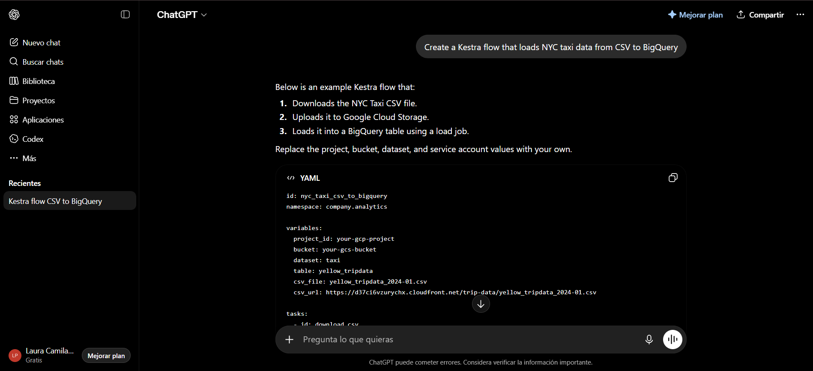
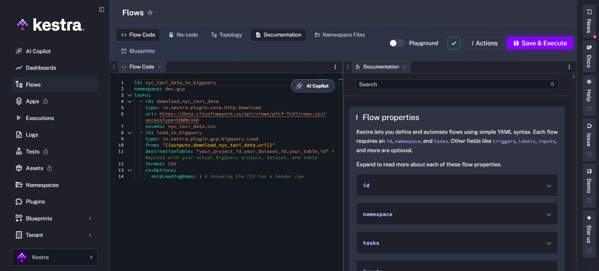
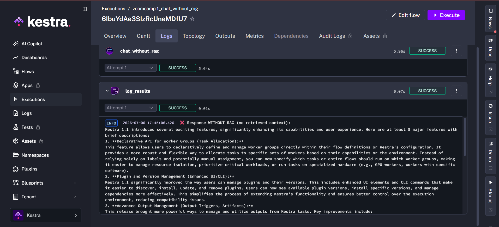
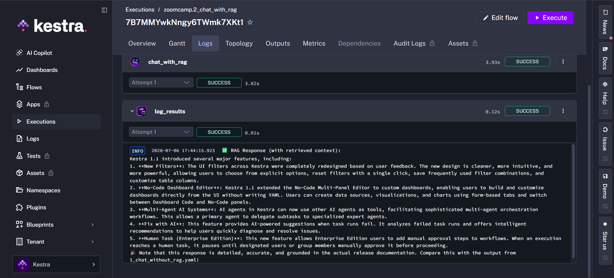
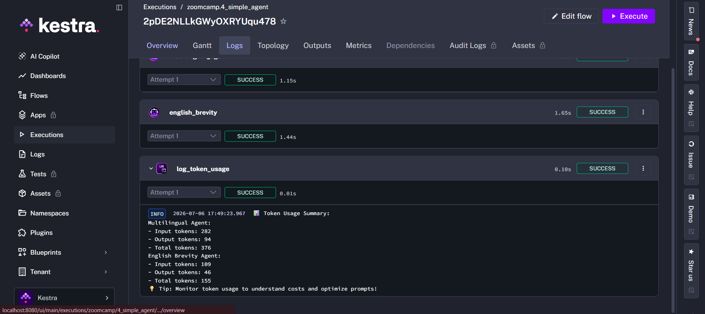
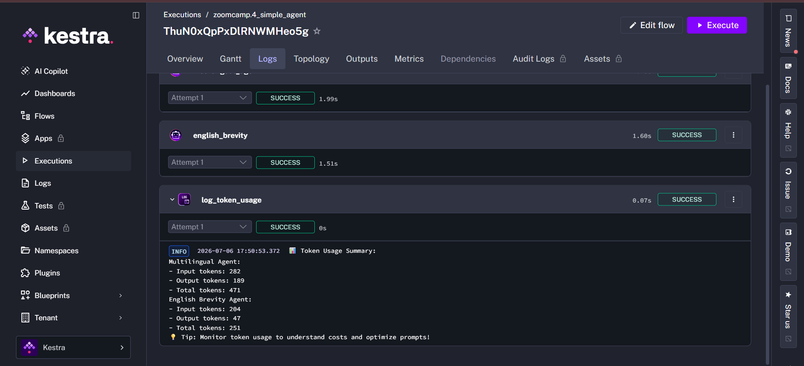
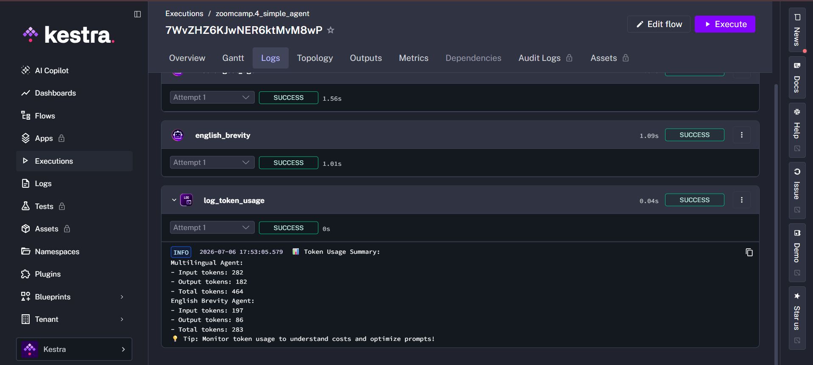

# Homework: AI Orchestration with Kestra

## Question 1: Context Engineering

## Question 2: RAG vs No RAG

**Answer:** Vague, generic, or fabricated — the model guesses from training data.

## Question 3: Token usage — short summary

**Answer:** 60-100 tokens.

## Question 4: Token usage — long summary

**Answer:** 2-5x more.

## Question 5: Modifying a flow

**Answer:** 2-4x more.

